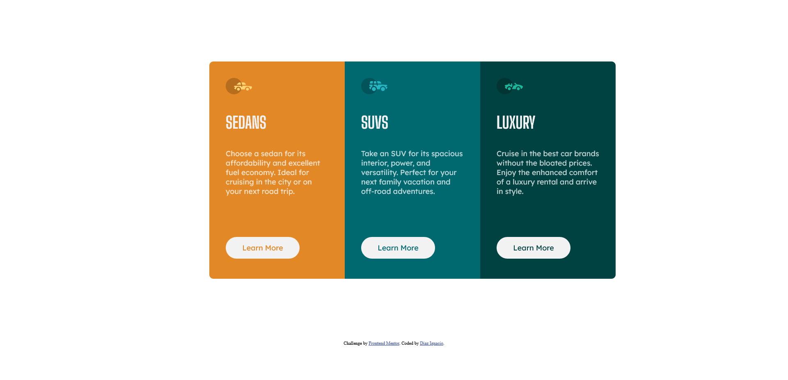

# Frontend Mentor - 3-column preview card component solution

This is a solution to the [3-column preview card component challenge on Frontend Mentor](https://www.frontendmentor.io/challenges/3column-preview-card-component-pH92eAR2-). Frontend Mentor challenges help you improve your coding skills by building realistic projects. 

## Table of contents

  - [The challenge](#the-challenge)
  - [Screenshot](#screenshot)
  - [Links](#links)
  - [Built with](#built-with)
- [Author](#author)

### The challenge

Users should be able to:

- View the optimal layout depending on their device's screen size
- See hover states for interactive elements

### Screenshot

### Links

- Solution URL: [Add solution URL here](https://github.com/informaticadiaz/three-column-card)
- Live Site URL: [Add live site URL here](https://informaticadiaz.github.io/three-column-card/)

## My process

### Built with

- Semantic HTML5 markup
- CSS custom properties

## Author

- Website - [Diaz Ignacio](https://www.diazignacio.ar)
- Frontend Mentor - [@informaticadiaz](https://www.frontendmentor.io/profile/informaticadiaz)
- Twitter - [@DiazIgnacioDev](https://twitter.com/DiazIgnacioDev)

